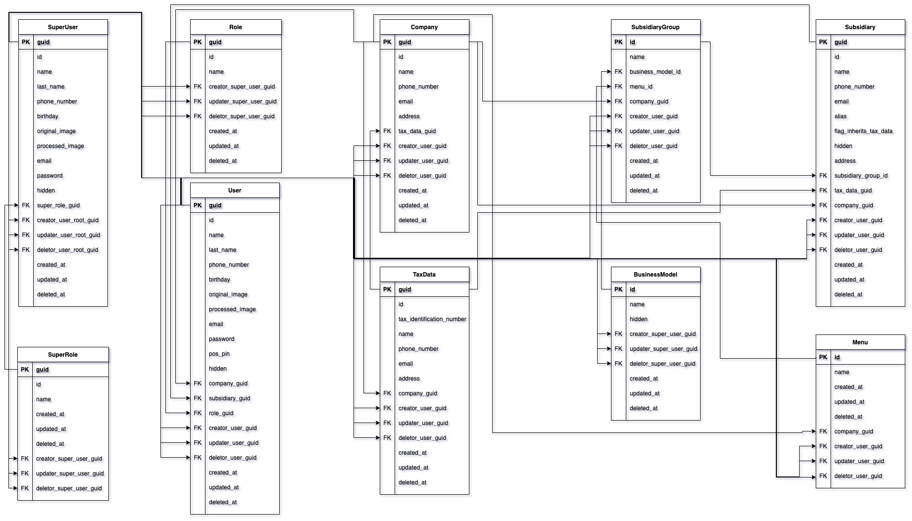

# ETAPA I DE DESARROLLO

Espacio destinado para la documentación de las entidades de la base de datos de 4UREST.

---

### VISTAS DE LA ETAPA I

El siguiente [enlace](https://www.figma.com/file/u6nGn2afrkYcpE3udvifrg/MVP?node-id=6%3A153) presenta las vistas y flujo de la Etapa I

--- 

### MODELO BASE DE LA ETAPA I

El modelo de la base de datos en la etapa 1 se presenta a continuación.

Diagrama de la base de datos [(Link aquí)](https://app.diagrams.net/#G12bfdBfGq1QhoH-HbKd0D5KDiGZxJKMYT).

---

### OPERACIONES BÁSICAS DE LA ETAPA I

En la **ETAPA I** del sistema, podrá ser capaz de ejecutar las siguientes operaciones con sus entidades:

| Entitie | Campos de entrada mínimos | Reglas para Create | Reglas para Update | Reglas para Soft Delete |
|-|-|-|-|-|
| SuperUser | name, last name, phone_number, email, password, super_role_guid | El super usuario creador debe tener el super rol autorizado para la acción. Se genera: guid, id, created_at. Se cumple con campos de entrada mínimos y creator_super_user_guid. | El super usuario actualizador debe tener el super rol autorizado para la acción. Se genera: updated_at. Se cumple con campos de entrada mínimos y updater_super_user_guid. | Un super usuario no se puede eliminar a si mismo. El super usuario eliminador debe tener el super rol autorizado para la acción. Se genera: deleted_at. Se cumple con campo deletor_super_user_guid. |
| SuperPermission | name | El super usuario creador debe tener el super rol autorizado para la acción. Se genera: id, created_at. Se cumple con campos de entrada mínimos y creator_super_user_guid | El super usuario actualizador debe tener el super rol autorizado para la acción. Se genera: updated_at. Se cumple con campos de entrada mínimos y updater_super_user_guid. | No se puede ejecutar la operación. |
| SuperRole | name | El super usuario creador debe tener el super rol autorizado para la acción. Se genera: guid, id, created_at. Se cumple con campos de entrada mínimos y creator_super_user_guid. | El super usuario actualizador debe tener el super rol autorizado para la acción. Se genera: updated_at. Se cumple con campos de entrada mínimos y updater_super_user_guid. | Que ningún super usuario tenga asignado  el super rol. El super usuario eliminador debe tener el super rol autorizado para la acción. Se genera: deleted_at. Se cumple con campo deletor_super_user_guid. |
| SuperRolePermission | super_role_guid, super_permission_guid | El usuario creador debe tener el super rol autorizado para la acción. Se genera: id, created_at. Se cumple con campos de entrada mínimos y creator_super_user_guid | No se puede ejecutar la operación. | El super usuario eliminador debe tener el super rol autorizado para la acción. Se aplica Hard Delete. |
| MasterActivityLog | entity, reg_guid, message | Se genera: id, created_at. Se cumple con campos de entrada mínimos y creator_super_user_guid | No se puede ejecutar la operación. | No se puede ejecutar la operación. |
| CompanySignUp | company_name, subsidiary_name, business_model_guid, user_name, user_last_name, user_phone_number, user_email, user_password | Se genera: id, created_at. Se cumple con campos de entrada mínimos. | El usuario debe de confirmar el correo electrónico o el número de teléfono. Se genera: updated_at. | No se puede ejecutar la operación. |

---

📝 [Editar Documento](https://github.com/4uRest/documentation)