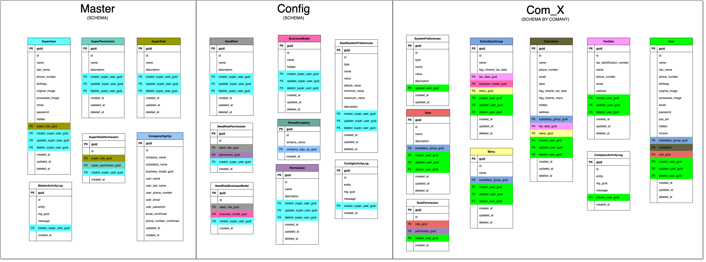

# DOCUMENTACIÓN 4UREST API

Espacio destinado para la documentación de las entidades de la base de datos de 4UREST.

El modelo de la base de datos en la etapa 1 se presenta a continuación.

📝 [Editar Documento](https://github.com/4uRest/documentation)