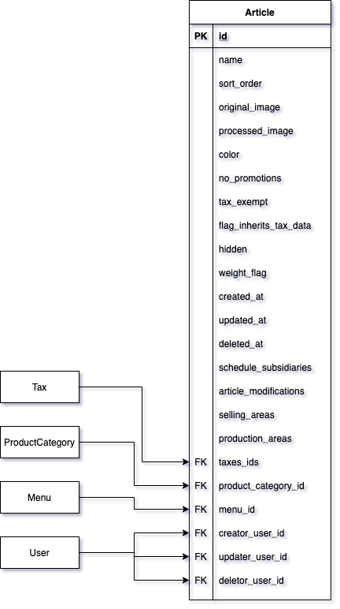

# Artículo

Entidad utilizada para representar y registrar un artículo en el sistema. Un artículo es una entidad que representa un producto que no pasa por un proceso de elaboración o preparación. Éste puede tener más de una variante del mismo. 

Por ejemplo:

Artículo: **CocaCola**

Variante 1: **400 ml**

Variante 2: **600 ml**

Variante 3: **2 lt**

### **1. Descripción de campos.**

El detalle de los campos de la tabla en la base de datos son:


| Tipo | Nombre | Descripción |
|-|-|-|
| int | id | Identificador único de registro. |
| string | name | Nombre del campo. |
| int | sort_order | Posición entre todos los elementos mostrados. Valor por defecto: 999 |
| string | original_image | Ruta de almacenamiento de imagen original. |
| string | processed_image | Ruta de almacenamiento de la imagen procesada y optimizada especialmente para el sistema. |
| string | color | Color de la tarjeta del producto: blanco, rojo, naranja, amarillo, verde, azul, azul marino, morado, negro, azul menta, verde lima, rosa. El color predeterminado es el blanco. |
| byte | no_promotions | Validación para permitir aplicar descuentos o promociones al artículo: 0 — no se puede aplicar, 1 — se puede aplicar |
| byte | tax_exempt | Validación para permitir exentar el artículo de impuestos: 0 — se pueden aplicar impuestos, 1 — exento de impuestos. Valor por defecto: 0. Orden de prioridades de campos de impuestos 1- tax_exempt, 2- flag_inherits_tax_data, 3- taxes_ids. |
| byte | flag_inherits_tax_data | Validación para permitir heredar los impuestos de la categoría a la que pertenece el artículo. Orden de prioridades de campos de impuestos 1- tax_exempt, 2- flag_inherits_tax_data, 3- taxes_ids. |
| byte | hidden | Validación para ocultar el artículo del menú por completo, sin excepción. Valor por defecto: 0. |
| byte | weight_flag | Validación para un artículo que se vende por peso: 0 — no se vende por peso, 1 — vendido por peso. |
| DateTime | created_at | Fecha y hora en la que se agregó el artículo al sistema por primera vez. Valor por defecto: NULL. |
| DateTime | updated_at | Fecha y hora en la que se actualizó el artículo en el sistema. Valor por defecto: NULL. |
| DateTime | deleted_at | Fecha y hora en la que se eliminó el artículo del sistema. Valor por defecto: NULL. |
| json | schedule_subsidiaries | Disponibilidad del artículo en el sistema por hora, día de la semana y sucursal. Ejemplo en el punto 2.1 |
| json | article_modifications | Variantes del artículo en el sistema. |
| json | selling_areas | Áreas de venta del artículo en el sistema por sucursal y por plataforma de venta. Ejemplo en el punto 2.2 |
| json | production_areas | Áreas de producción del artículo en el sistema por sucursal. |
| int[] | taxes_ids | Arreglo de impuestos aplicados al artículo. Orden de prioridades de campos de impuestos 1- tax_exempt, 2- flag_inherits_tax_data, 3- taxes_ids. |
| int | product_category_id | Identificador de la categoría de producto a la que pertenece el artículo. |
| int | menu_id | Identificador del menú al que pertenece el artículo. |
| int | creator_user_id | Identificador del usuario que registro el artículo por primera vez. |
| int | updater_user_id | Identificador del ultimo usuario que actualizó el artículo. |
| int | deletor_user_id | Identificador del usuario que eliminó el artículo. |

### **2.  Descripción de campos JSON.**

El detalle de los campos de tipo **JSON** de la tabla son:


#### **2.1 Campo schedule_subsidiaries**

En este ejemplo tenemos lo siguiente.


```json
{
"availability":[
	{
"subsidiary_id": "2" ,
“schedule_monday”:    {
        "status": "2" ,
        "start_time": "00:00",
        "end_time": "00:00",
},
“schedule_tuesday”:    {
        "status": "2" ,
        "start_time": "00:00",
        "end_time": "00:00",
},
“schedule_wednesday”:    {
        "status": "2" ,
        "start_time": "00:00",
        "end_time": "00:00",
},
“schedule_thursday”:    {
        "status": "2" ,
        "start_time": "00:00",
        "end_time": "00:00",
},
“schedule_friday”:    {
        "status": "2" ,
        "start_time": "00:00",
        "end_time": "00:00",
},
“schedule_saturday”:    {
        "status": "2" ,
        "start_time": "00:00",
        "end_time": "00:00",
},
“schedule_sunday”:    {
        "status": "2" ,
        "start_time": "00:00",
        "end_time": "00:00",
}

},
{
"subsidiary_id": "39" ,
“schedule_monday”:    {
        "status": "2" ,
        "start_time": "00:00",
        "end_time": "00:00",
},
“schedule_tuesday”:    {
        "status": "2" ,
        "start_time": "00:00",
        "end_time": "00:00",
},
“schedule_wednesday”:    {
        "status": "2" ,
        "start_time": "00:00",
        "end_time": "00:00",
},
“schedule_thursday”:    {
        "status": "2" ,
        "start_time": "00:00",
        "end_time": "00:00",
},
“schedule_friday”:    {
        "status": "2" ,
        "start_time": "00:00",
        "end_time": "00:00",
},
“schedule_saturday”:    {
        "status": "2" ,
        "start_time": "00:00",
        "end_time": "00:00",
},
“schedule_sunday”:    {
        "status": "2" ,
        "start_time": "00:00",
        "end_time": "00:00",
}

},

]
}
```

#### **2.2 Campo selling_areas**

En este ejemplo tenemos lo siguiente.

**Sucursales:**

| Sucursal | Id |
|-|-|
| SUCURSAL 1 | 15 |
| SUCURSAL 2 | 20 |

**Medios de venta en SUCURSAL 1:**

| Medio de Venta | Id |
|-|-|
| MOSTRADOR | 89 |
| UBER | 16 |

**Medios de venta en SUCURSAL 2:**

| Medio de Venta | Id |
|-|-|
| MOSTRADOR | 99 |
| DIDI | 78 |


```json
{
"SalesAreaBySubsidiary":[
    {
    "sucursal_id": "15",
    "platforms":[
        {
        "sale_platform_id":"89",
        "price": "19.99"
        },
        {
        "sale_platform_id":"16",
        "price": "34"
        }
    ]
},
{
    "sucursal_id": "20",
    "platforms":[
        {
        "sale_platform_id":"99",
        "price": "25.5"
        },
        {
        "sale_platform_id":"78",
        "price": "38"
        }
    ]
}
]
}
```
_ _ _

Article table 1


Article table 2




Diagrama de la base de datos [(Link aquí)](https://app.diagrams.net/#G1TR1Q9nC36PcOae7jeaJIxgDLTjUUpkfL).


📝 [Editar Documento](https://github.com/4uRest/documentation)